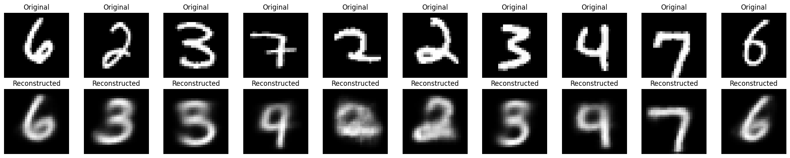
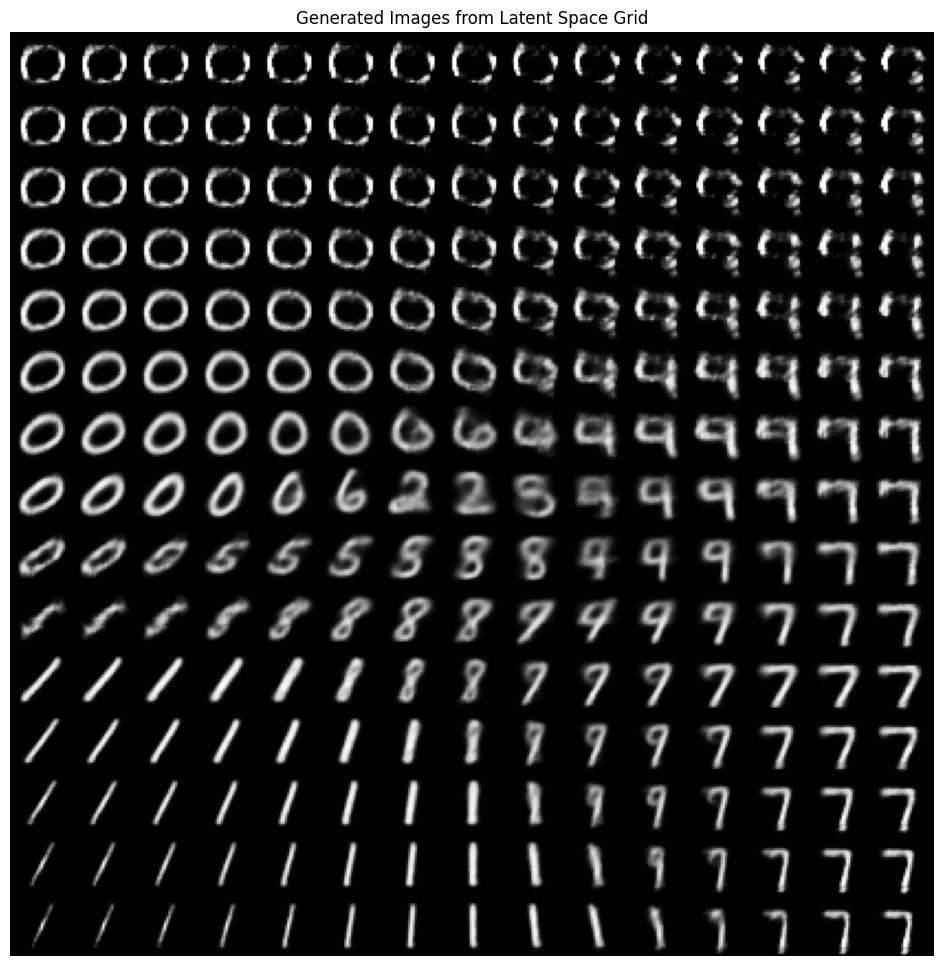

## 1. Architecture Description

### 1.1 Convolutional Autoencoder Architecture

The implemented convolutional autoencoder consists of two main components: an encoder and a decoder network designed for MNIST digit reconstruction.

**Encoder Architecture:**
- **Input Layer**: 28×28×1 grayscale images
- **Conv Layer 1**: 32 filters, 3×3 kernel, ReLU activation, stride 1, same padding
- **Max Pooling 1**: 2×2 pooling, reduces spatial dimensions to 14×14
- **Conv Layer 2**: 32 filters, 3×3 kernel, ReLU activation, stride 1, same padding
- **Max Pooling 2**: 2×2 pooling, further reduces to 7×7 (bottleneck: 7×7×32 = 1,568 dimensions)

**Decoder Architecture:**
- **Conv Layer 1**: 32 filters, 3×3 kernel, ReLU activation, same padding
- **UpSampling 1**: 2× upsampling to 14×14
- **Conv Layer 2**: 32 filters, 3×3 kernel, ReLU activation, same padding
- **UpSampling 2**: 2× upsampling to 28×28
- **Output Layer**: 1 filter, 3×3 kernel, sigmoid activation (pixel values in [0,1])

The autoencoder was trained for 10 epochs with Adam optimizer, batch size of 256, and binary cross-entropy loss.

### 1.2 Variational Autoencoder (VAE) Architecture

The VAE extends the standard autoencoder with probabilistic encoding and a principled generative framework.

**VAE Encoder:**
- **Input Layer**: 28×28×1 MNIST images
- **Conv Layer 1**: 32 filters, 3×3 kernel, ReLU, stride 2, same padding → 14×14
- **Conv Layer 2**: 64 filters, 3×3 kernel, ReLU, stride 2, same padding → 7×7
- **Flatten Layer**: 7×7×64 = 3,136 dimensions
- **Dense Layer**: 16 units, ReLU activation
- **Latent Parameters**: Two parallel dense layers output `z_mean` and `z_log_var` (each 2D for visualization)
- **Sampling Layer**: Implements reparameterization trick: $z = \mu + \sigma \odot \epsilon$, where $\epsilon \sim \mathcal{N}(0, I)$

**VAE Decoder:**
- **Latent Input**: 2D latent vector
- **Dense Layer**: 7×7×64 = 3,136 units, ReLU activation
- **Reshape**: Back to 7×7×64 feature maps
- **Transposed Conv 1**: 64 filters, 3×3 kernel, ReLU, stride 2 → 14×14
- **Transposed Conv 2**: 32 filters, 3×3 kernel, ReLU, stride 2 → 28×28
- **Output Layer**: 1 filter, 3×3 kernel, sigmoid activation

**Loss Function:**
$$\mathcal{L} = \mathcal{L}_{\text{recon}} + \mathcal{L}_{\text{KL}}$$

where:
- $\mathcal{L}_{\text{recon}} = \mathbb{E}[\text{Binary Cross-Entropy}(x, \hat{x})]$ (reconstruction loss)
- $\mathcal{L}_{\text{KL}} = -\frac{1}{2}\sum_{j=1}^{J}(1 + \log\sigma_j^2 - \mu_j^2 - \sigma_j^2)$ (KL divergence)

The VAE was trained for 20 epochs with Adam optimizer (learning rate 1e-3) and batch size of 128.

---

## 2. Visualizations

### 2.1 Autoencoder Reconstructions

The trained convolutional autoencoder successfully reconstructed MNIST digits from the test set. Visual inspection reveals:
- **High Fidelity**: Original and reconstructed images are nearly indistinguishable
- **Feature Preservation**: Essential digit characteristics (curves, lines, structure) are maintained
- **Slight Blurring**: Minor smoothing effect due to compression in the bottleneck layer
- **Consistent Performance**: Uniform reconstruction quality across all digit classes (0-9)

### 2.2 VAE Reconstructions

The VAE's reconstructed images demonstrate:
- **Good Quality**: Reconstructed digits are recognizable and semantically accurate
- **Slightly More Blurred**: Compared to standard autoencoder due to probabilistic sampling
- **Variability**: Multiple reconstructions of the same input differ slightly due to stochastic sampling

### 2.3 VAE Latent Space Visualization (2D)

The 2D latent space visualization reveals remarkable structure:
- **Digit Clustering**: Different digit classes form distinct, well-separated clusters
- **Smooth Transitions**: Continuous paths exist between digit clusters
- **Organized Layout**: Similar digits (e.g., 4 and 9, or 3 and 8) occupy neighboring regions
- **Standard Normal Prior**: The distribution centers around (0,0) with most points within [-3, 3]

### 2.4 VAE Generated Images

**Latent Space Grid Sampling:**
A 15×15 grid sampled uniformly from [-3, 3] in both latent dimensions shows:
- **Smooth Interpolation**: Gradual morphing between digit types across the grid
- **Semantic Continuity**: Adjacent grid positions produce visually similar digits
- **Coverage**: Most regions produce recognizable digits, though extreme corners show artifacts

**Random Generation:**
Sampling 10 random latent vectors from $\mathcal{N}(0, I)$ produces diverse, realistic digit images, demonstrating the VAE's true generative capability.

---

## 3. Differences Between Autoencoders and VAEs

| **Aspect** | **Standard Autoencoder** | **Variational Autoencoder** |
|------------|--------------------------|----------------------------|
| **Encoding** | Deterministic: $z = f_{\text{enc}}(x)$ | Probabilistic: $q(z|x) = \mathcal{N}(\mu(x), \sigma^2(x))$ |
| **Latent Space** | Unstructured, potentially discontinuous | Continuous, regularized by KL divergence |
| **Loss Function** | Reconstruction loss only | Reconstruction + KL divergence |
| **Generative Capability** | Poor - cannot sample meaningfully | Excellent - samples from $p(z) = \mathcal{N}(0, I)$ |
| **Interpolation** | May produce unrealistic intermediate images | Smooth, meaningful interpolations |
| **Overfitting Risk** | High - can memorize training data | Lower - regularization prevents overfitting |
| **Interpretability** | Limited latent structure | Organized, disentangled representations |
| **Use Cases** | Dimensionality reduction, denoising | Image generation, data augmentation, creative applications |

**Key Insight:** The VAE's probabilistic framework and KL divergence regularization transform the latent space from a sparse, disconnected representation into a continuous probability distribution, enabling true generative modeling capabilities that standard autoencoders lack.

---

## 4. Challenges and Limitations

### 4.1 Implementation Challenges

**Hyperparameter Tuning:**
- Balancing reconstruction loss and KL divergence required careful tuning
- Latent dimensionality (2D) chosen for visualization but limits expressive capacity
- Learning rate and batch size significantly impact convergence stability

**KL Divergence Behavior:**
- Risk of "posterior collapse" where KL term vanishes, decoder ignores latent code
- Required careful monitoring during training to ensure balanced loss components

**Computational Complexity:**
- VAE training slower than standard autoencoder due to sampling and dual loss computation
- Larger latent dimensions increase parameter count significantly

### 4.2 Model Limitations

**Reconstruction Quality:**
- Both models produce slightly blurred reconstructions due to compression
- VAE reconstructions slightly inferior to standard AE due to stochastic sampling
- Sharp edges and fine details sometimes lost in bottleneck

**Generation Quality (VAE):**
- Generated images from extreme latent regions (far from training distribution) show artifacts
- Limited expressiveness with 2D latent space - higher dimensions needed for complex datasets
- Mode collapse not observed in MNIST but possible with more complex data

**Dataset Specificity:**
- Current architectures optimized for 28×28 grayscale images
- Scaling to larger, color images (e.g., CIFAR-10, ImageNet) requires deeper networks
- MNIST's simplicity masks challenges that arise with natural images

**Theoretical Limitations:**
- VAE's Gaussian assumption for posterior may not fit all data distributions
- KL divergence regularization creates reconstruction-generation trade-off
- Standard autoencoder's bottleneck can be too restrictive, losing critical information

### 4.3 Practical Considerations

- **Training Stability**: VAE requires careful balancing of loss terms; beta-VAE variants may improve
- **Evaluation Metrics**: Reconstruction loss doesn't fully capture generative quality; FID, IS scores needed
- **Interpretability**: While 2D latent space is visualizable, higher dimensions lose this advantage
- **Computational Cost**: Real-time applications may require model compression or distillation

**References:**
1. Kingma, D. P., & Welling, M. (2013). Auto-Encoding Variational Bayes. arXiv:1312.6114
2. Goodfellow, I., Bengio, Y., & Courville, A. (2016). Deep Learning. MIT Press.
3. Doersch, C. (2016). Tutorial on Variational Autoencoders. arXiv:1606.05908
